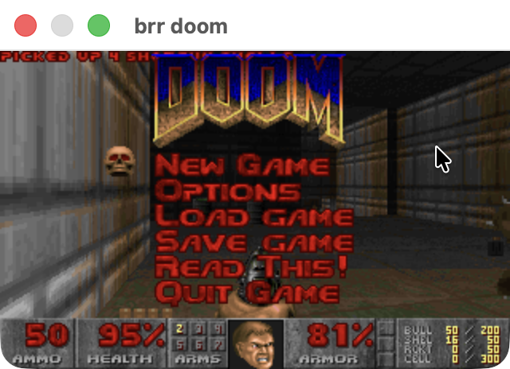

# brr DOOM
A DOOM port using brr.h, based on [doomgeneric](https://github.com/ozkl/doomgeneric/) by ozkl.  

#### Build 
```bash
# macOS
make -f Makefile.macos && ./out/doom -iwad ~/wad/doom.wad

# linux
make -f Makefile.linux && ./out/doom -iwad ~/wad/doom.wad

# windows (mingw)
make -f Makefile.win && ./out/doom.exe -iwad ~/wad/doom.wad
```