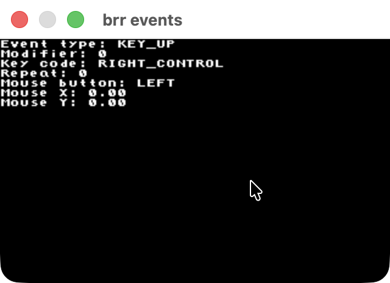

# brr events
An events inspector for brr.h 

#### Build 
```bash
# macOS
gcc -x objective-c -framework Cocoa events.c -o events && ./events

# linux
gcc events.c -lX11 -lXext -o events && ./events

# windows (MSVC)
cl events.c && events.exe

# windows (mingw)
gcc events.c -mwindows -o events.exe && ./events.exe
```
