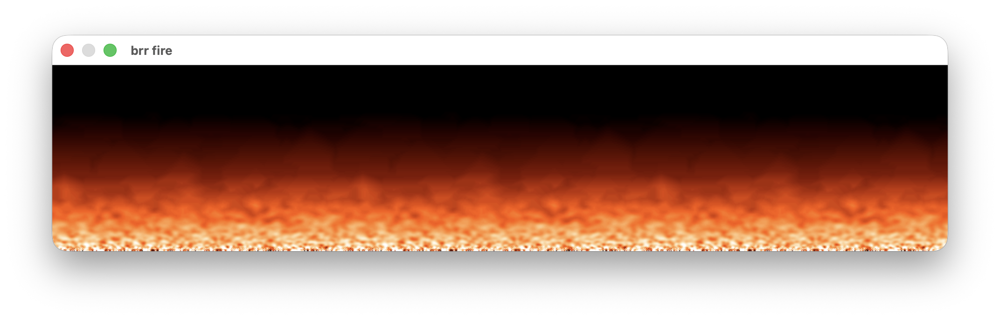

# brr fire
The Classic Fire Effect for brr.h mostly stolen from https://lodev.org/cgtutor/fire.html

#### Build
```bash
# macOS
gcc -x objective-c -framework Cocoa fire.c -o fire && ./fire

# linux
gcc fire.c -lX11 -lXext -o fire && ./fire

# windows (MSVC)
cl fire.c && fire.exe

# windows (mingw)
gcc fire.c -mwindows -o fire.exe && ./fire.exe
```
