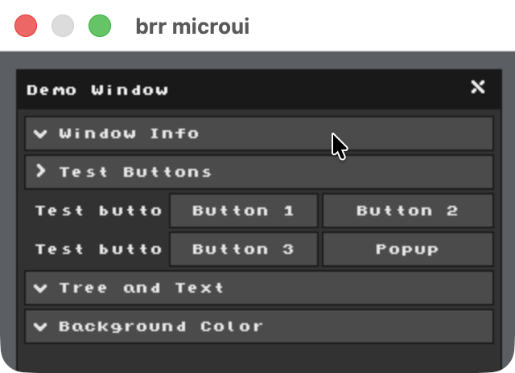

# brr microui
A demo showcasing the microui ui library with brr.h

#### Build 
```bash
# macOS
gcc -x objective-c -framework Cocoa main.c microui.c -o main && ./main

# linux
gcc main.c microui.c -lX11 -lXext -o main && ./main

# windows (MSVC)
cl main.c microui.c && main.exe

# windows (mingw)
gcc main.c microui.c -mwindows -o main.exe && ./main.exe
```