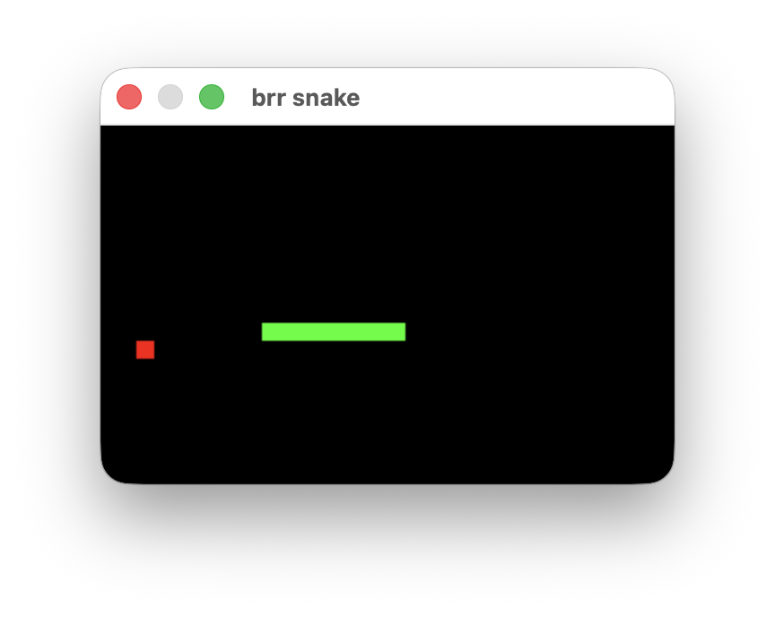

# brr snake
A classic snake for brr.h

#### Build
```bash
# macOS
gcc -x objective-c -framework Cocoa snake.c -o snake && ./snake

# linux
gcc snake.c -lX11 -lXext -o snake && ./snake

# windows (MSVC)
cl snake.c && snake.exe

# windows (mingw)
gcc snake.c -mwindows -o snake.exe && ./snake.exe
```
